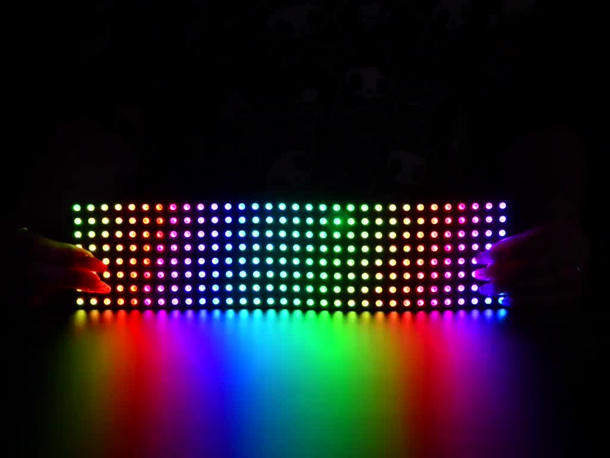
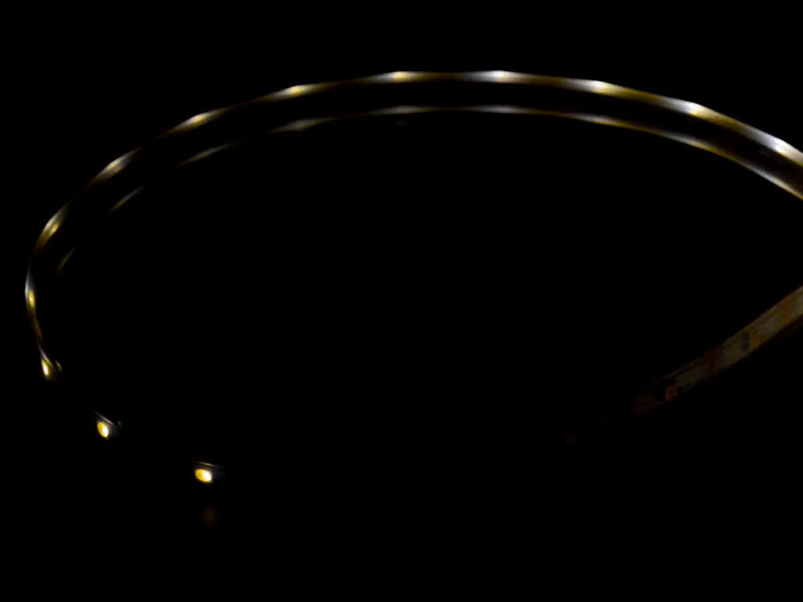
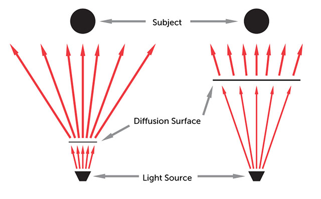

layout: true

<footer>
dinosaur.is/leds-101/
</footer>

---
class: center

# an introduction to off-grid programmable LED art

slides: https://dinosaur.is/leds-101/

source: https://github.com/ahdinosaur/leds-101


???

---
class: center

## hi

we're [Mikey](https://dinosaur.is) and [Ben](http://www.bennolan.com/)

we've done a few LED things before, learned some beeps and boops that we want to share!

???

---
class: center

## what to expect from this workshop

this workshop is a whirlwind introduction to the concepts and practices to get started with off-grid art using programmable LEDs.

in our short time together, we hope to provide useful breadcrumbs to help you navigate the trails ahead:

- an overview of the landscape
- what things in this world are called
- how to get started on your journey
- what to look out for as you go
- some tips and tricks for your practice

???

---

## outline

1. programmable LEDs, what are they?
2. how do you control them? (arduino and basic programming)
3. how do you connect to/from them? (soldering strips, JST plugs)
4. how do you power them? (buck converters + 12v batteries or 18650s or AAs)
5. how do you diffuse them?

with a bonus round of 'how to order the good shit from AliExpress'.

---
class: center

## what are programmable LEDs?

we're going to be playing with WS2812B or [APA102C](https://www.pololu.com/product/2552) (or [SK9822](https://www.pololu.com/product/3086)) LEDS.

- each pixel is individually addressable (can be an independent color)
- you talk to the LEDs over wire(s) using a protocol called [SPI](https://en.wikipedia.org/wiki/Serial_Peripheral_Interface)
- powered at 5V (or lower voltages such as 3.3V is acceptable)

<a class="thumbnail" href="https://www.adafruit.com/product/2477">
  <video preload="auto" muted="" loop="" autoplay="" poster="./images/2477-04.jpg">
    <source src="./images/2477-04.mp4">
    
  </video>
</a>
<a class="thumbnail" href="https://www.adafruit.com/product/2736">
  <video preload="auto" muted="" loop="" autoplay="" poster="./images/2736-03.jpg">
    <source src="./images/2736-03.mp4">
    
  </video>
</a>
<a class="thumbnail" href="https://www.adafruit.com/product/2868">
  <video preload="auto" muted="" loop="" autoplay="" poster="./images/2868-07.jpg">
    <source src="./images/2868-07.mp4">
    
  </video>
</a>
<a class="thumbnail" href="https://www.adafruit.com/product/2860">
  <video preload="auto" muted="" loop="" autoplay="" poster="./images/2860-04.jpg">
    <source src="./images/2860-04.mp4">
    
  </video>
</a>
<a class="thumbnail" href="https://www.adafruit.com/product/2237?length=1">
  <video preload="auto" muted="" loop="" autoplay="" poster="./images/2237-08.jpg">
  <source src="./images/2237-08.mp4">
  
  </video>
</a>
<a class="thumbnail" href="https://www.adafruit.com/product/2435?length=2">
  <video preload="auto" muted="" loop="" autoplay="" poster="./images/2435-05.jpg">
    <source src="./images/2435-05.mp4">
    
  </video>
</a>

???

most common form is as a strip

---

### other types of electro-magic lights

- single (high-power) LED
- 12v single-color LED strips
- El-Wire
- El-Tape
- El-Panel
- and more

---

## how do you control the LEDs?

to control your heap of LEDs, you will use a micro-controller (a small computer) to send messages over a wire to the first LED, who will relay extra messages to the next LED, and so on.

### Downloads:

* [Arduino IDE](https://www.arduino.cc/en/Main/Software)
* [Fastled](http://fastled.io) - install from `Sketch -> Include Library -> Manage Libraries`
* [CH340g driver](https://sparks.gogo.co.nz/ch340.html)

(Chinese arduinos come with a non standard usb chip - called the ch340g - it works
perfectly - but you need to installed the drivers for your operating system)

#### Run example sketch

Once you've installed the fastled library - go to `file -> examples -> fastled -> blink`. Click
`Upload` and you should have a blinking led.

???

### [SPI](https://en.wikipedia.org/wiki/Serial_Peripheral_Interface) (Serial Peripheral Interface)


reference: https://www.pololu.com/product/2552

---

### micro-controller

we will be using the popular Arduino flavor of micro-controllers.

- [Arduino Uno](https://store.arduino.cc/usa/arduino-uno-rev3)
  - 
- [Teensy](https://www.pjrc.com/teensy/index.html)
  - 
- [Adafruit Feather](https://learn.adafruit.com/adafruit-feather)
  - 

---

### [FastLED](http://fastled.io/)

we will use a library _FastLED_ to help us code the LEDs.

```
#include <FastLED.h>

#define NUM_LEDS 60
#define DATA_PIN 6

CRGB leds[NUM_LEDS];

void setup () { 
  FastLED.addLeds<WS2812>(leds, DATA_PIN, NUM_LEDS);
}

void loop () {
  leds[0] = CRGB::Red; 
  FastLED.show(); 
  delay(30); 
}
```

---

### [HSV](https://en.wikipedia.org/wiki/HSL_and_HSV)

compare to RGB color space


---

### [Noise](https://en.wikipedia.org/wiki/Perlin_noise)

noise functions generate random numbers with smooth steps


---

### adding physical interfaces

- buttons
- rotary encoders
- accelerometer
- magnetometer
- gryoscope
- temperature gauge
- midi shield

e.g. [Teensy Prop Shield](https://nicegear.nz/product/teensy-prop-shield)

---

### helper functions

help you write code in terms of your shape

```
set_color(x, y, color)
```

```
set_color(x, y, z, color)
```

```
set_color(root, branch, index, color)
```

---

### examples

- single: rainbow fade
- strip: rainbow scroll
- strip: rainbow chase
- grid: explosion

---

## how to connect to/from the LEDs?

we will need a way to connect from the controller to the LEDs,

and from each chain of LEDs to the next chain.

---

### 3-pin or 4-pin?

some LED chips, such as the APA102, have 4 pins:

1. GND
2. DATA
3. CLOCK
4. +5V

to reduce cost, some LED chips, such as the WS2812, have 3 pins:

1. GND
2. DATA
3. +5V

---

### 3-pin / 4-pin jst connectors

[Amazon](https://www.amazon.com/RGBZONE-20Pairs-Female-Connector-Adapter/dp/B075K3M1TB)

- pre-installed on LED strips by default
- useful wire-to-wire connector
- not waterproof

---

### 3-pin / 4-pin header connectors

[Amazon](https://www.amazon.com/gp/product/B0777BQC1P/)

- useful wire-to-wire and board-to-wire connector
- not waterproof

---

### 3-pin / 4-pin waterproof connectors

[Amazon](https://www.amazon.com/BTF-LIGHTING-Plastics-waterproof-connctor-Applicable-x/dp/B01LCV8T62/)

- waterproof

---

### soldering tips

- pre-requisites
  - solder
  - soldering iron
  - wire
  - wire stripper
  - (recommended) multimeter
  - (recommended) "third hand"
- watch YouTube tutorials

---

### waterproofing tips

buy IP67 LEDs

if cutting LED strips, use silicon glue to re-seal

---

## how to power the leds?

we will need a way to power the LEDs, they are very bright!

---

## what is power

_current_ ~= how much electricity is flowing

_voltage_ ~= how strong the electricty is flowing

```
power (in watts) = current (in amps) * voltage (in volts)
```

for example:

```
10 watts = 2 amps * 5 volts
```

---


### power usage

each LED uses up to 60mA when white at full brightness.

in practical use, when not using white, we use 20mA as a rule of thumb, with lower brightnesses even lower.

```
60 pixels × 20 mA ÷ 1,000 = 1.2 Amps minimum
```


???

references:

- https://www.pololu.com/product/2552
- https://cdn-shop.adafruit.com/datasheets/APA102.pdf
- https://learn.adafruit.com/adafruit-neopixel-uberguide/powering-neopixels

---

### power injection


---

### reducing power use

- each pixel is actually 3 LEDs: red + green + blue
  - displaying red only uses 1/3 the power
  - displaying purple (red + blue) uses 2/3 the power
  - displaying white uses 3/3 the power
- not every pixel must be on at all times!

???

reference: https://learn.adafruit.com/sipping-power-with-neopixels

---

### using many power supplies

if you need to use many power supplies:

- each power supply's GROUND is connected in common
- each power supply's +5V is connected to **one** length of pixels

???

each power supply has slightly different +5V, if they are connected they will back-feed into each other and very bad things may happen.

---

### 5v power supply

---

### battery electrons

batteries are measured in volts and amp hours.

an amp hour is one amp of current for an hour.

many batteries together:

- in parallel, add current
- in series, add voltage

---

### 12v battery + dc step-down (buck) converter

Depending on your needs you could get a small 7ah, medium 40ah or big honking
120ah battery. Charge them off a 15w / 30w / 100w solar panel (using a `solar
controller` from aliexpress). Can get 12v batteries from computer recycling shops,
second hand, or from a friend that has access to big data centres (transpower?).

The 12v battery is great for charging up and running all night, and will take
power from a solar panel - but you can't power the LED strip directly.

You'll need a `buck converter` (dc-dc step down), it takes 12-14 volts in
and converts it to 5 volts. Buck converters are really cheap $1-$20 depending
on how many amps you need to put through.

Most cheap buck converters come with no preset voltage output, so you need to 
use a multimeter to measure the output voltage, hook the input up to a 12 volt
battery, then turn the eensy-weensy-tiny little screw many many times until
the voltage going into the multimeter drops down to about 5 volts.

---

### 18650 batteries

These are the lithium ion cells that are in a vape pen. You can get them by
pulling apart a cylindrical (eg thinkpad) laptop battery pack, or buy them from
pbtech or a vape shop (probably most expensive).

You can get chargers (nitecore make good ones) to recharge your batteries before
the burn, and you could take your charger to recharge your batteries if they
go flat at the burn.

You can buy 18650 holders from aliexpress that hold one battery and give
you two leads that you can run to your arduino / leds.

---

### aa batteries

Use 4 x AA's in a little holder (search for aa holder on aliexpress) to power your
stuff. Rechargeable batteries are best. Eneloop make excellent rechargeables and
a fast charger. The nitecore d4 charger can recharge AAs and will probably
run quite well off a 12v system for recharging at the burn.

[Adafruit](https://www.adafruit.com/product/830)

---
class: center

## diffusion

LEDs are bright af!

Buy aluminum channel (aluminum profile) with a built in diffuser. Or use fabric.

---
class: center

### what is a diffuser?

<a href="https://forum.arduino.cc/index.php?topic=415472.0">
  
</a>

???

references:

- https://hackaday.com/2018/08/15/friday-hack-chat-led-diffusion/
- https://www.wikihow.com/Diffuse-Light

---
class: center

### how does a diffuser work?

<a href="http://close-uppity.derekhauffe.net/diffusion/">
  
</a>

???

- must have some distance between light source and diffuser

---

### what are good diffusers?

- excellent: built-in aluminum channel diffusers
- great: dish foam (for packing your dishes in boxes)
- great: white faux fur
- good: bubble wrap
- okay: baking paper
- ???

---
class: center

## how do you get started?

---

### what parts do we need?

there are 3 major parts to the system:

1. LEDs
1. controller
1. power source

---

### beginner parts

- LEDs: start with LED strips
  - [Adafruit Neopixel](http://www.adafruit.com/category/168) / [AliExpress WS2812]()
  - [Adafruit DotStar](https://www.adafruit.com/category/885) / [AliExpress APA102]()
- LED connector: start with JST connectors
- controller: start with [Arduino Nano](https://store.arduino.cc/usa/arduino-nano) or [Teensy](https://www.pjrc.com/store/teensylc.html)
  - [NiceGear Teensy LC](https://nicegear.nz/product/teensy-lc)
- power source:
  - if small, use usb power pack
  - if large, use deep cycle battery

### How to aliexpress

1. Find the right search term (arduino nano, ws2812b, buck converter).
2. Search for that.
3. Sort by 'most orders'

Buy from the first seller you find with:

* The thing you want
* Free shipping 17-36 days (will probably arrive in 2 weeks)
* The most orders
* A pretty good price

Order twice the quantity as you think you need, since if you break
one or it arrives damaged, you won't be able to re-order before the 
burn. Don't need to buy twice as much strip, but definitely buy one
more roll than you think you'll need.

Don't order lithium ion batteries (18650s) they will take 6 months to
arrive.

---

# thanks

=^.^=

???

thanks for your attention

we barely even scratched the surface

if you want to learn more, then get amongst!
